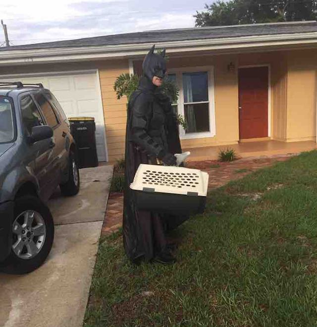

# News_story

## Guy Dressed as Batman Has Rescued Dozens of Shelter Pets From Euthanasia

27-year-old **Chris Van Dorn** has always been a fan of the beloved Caped Crusader; so when he began volunteering for various animal rescue organizations around Orlando, Florida, he decided to combine his two passions and use a Batman suit to bring attention to the importance of pet adoption.

> "It kind of just came as a way to embody all the good I wanted to do in the world,” Van Dorn told The Dodo, “and make it easy for people to talk to me right off the bat."

Main Points: 

* Saves animals from euthanasia 
* Wears batman costume 

[Read the whole article here](https://www.goodnewsnetwork.org/guy-dressed-as-batman-rescues-shelter-pets-from-euthanasia/)
